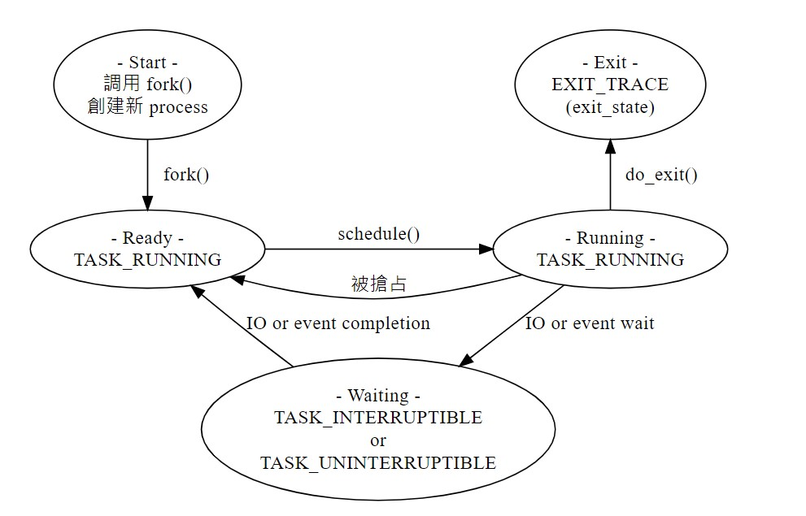
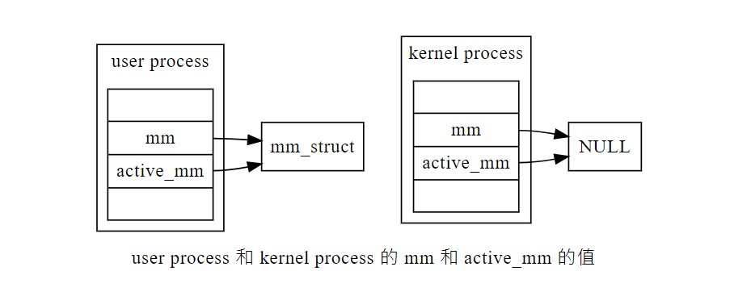
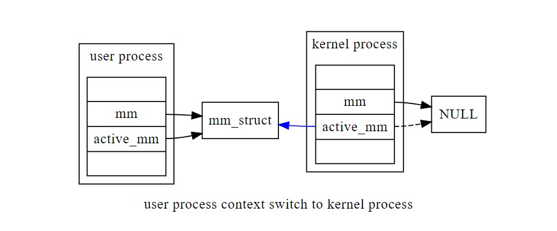
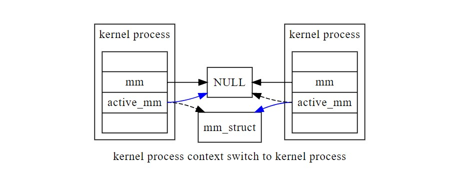
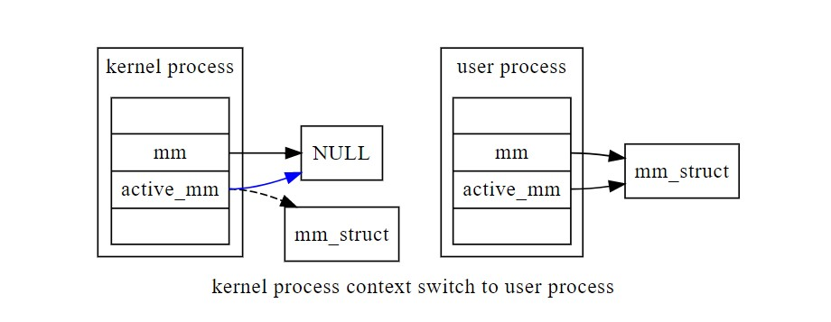
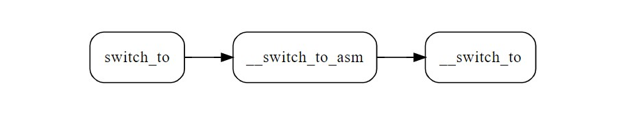

# Linux - Project3
>info
>第23組
>107502533 張文耀
>107502504 歐亭昀
107502502 林欣蓓


## 目標
1. 取得程式 context switch 的次數
2. 取得程式進入 waiting queue 的次數

## task_struct
> 因為這次的兩個目標都是計算狀態切換的次數，所以我們先在`task_struct`中宣告兩個計數器。
```c=
struct task_struct {
#ifdef CONFIG_THREAD_INFO_IN_TASK
    struct thread_info    thread_info;
#endif
    unsigned int          __state;
    ...
    ...
    /** 中間省略 **/
    ...
    ...
    unsigned int cs_count; // context switch 次數
    unsigned int wq_count; // 進入 wait queue 次數

   /*
    * New fields for task_struct should be added above here, so that
    * they are included in the randomized portion of task_struct.
    */
    randomized_struct_fields_end

    /* CPU-specific state of this task: */
    struct thread_struct		thread;

   /*
    * WARNING: on x86, 'thread_struct' contains a variable-sized
    * structure.  It *MUST* be at the end of 'task_struct'.
    *
    * Do not put anything below here!
    */
};
```
> 在上面的第11和第12列，我們加了兩個計數器，分別是：  
> 1. cs_count：process context switch 的次數。
> 2. wq_count：process 進入 wait queue 的次數。  
> 
> 有趣的是在 5.14.14 版本中，如果要對 `task_struct` 增加新的欄位不能直接加在最後面，因為最後面有個可變長度的欄位 `thread_struct`，必須加在此欄位之前。
## copy_process

```c=
static __latent_entropy struct task_struct *copy_process(
					struct pid *pid,
					int trace,
					int node,
					struct kernel_clone_args *args)
{
    int pidfd = -1, retval;
    struct task_struct *p;
    struct multiprocess_signals delayed;
    struct file *pidfile = NULL;
    u64 clone_flags = args->flags;
    ...
    ...
    /* 中間省略 */
    ...
    ...
    uprobe_copy_process(p, clone_flags);

    copy_oom_score_adj(clone_flags, p);

    p->cs_count=0;
    p->wq_count=0;

    return p;

    ...
    /* 以下為 error handler，省略 */
}
```
> 接著我們在 process 初始化時，也就是在 `copy_process()` 這個 funtion 中將我們剛剛增加的兩個欄位初始化為零(第21和22列)。
## process 狀態


**在 task_struct 中的 __state 欄會記錄此 process 的狀態，常見的狀態有以下幾種**
| 狀態 | 描述 |
| --- | --- |
| TASK_RUNNING | 在 Linux 中，ready 和 running 屬於同一個狀態。此狀態的 process 會被加到某個 cpu 的 run queue 中。|
| TASK_INTERRUPTIBLE | process 因為在等待某事件完成(例如IO事件)而進入 wait queue，等待途中可以被 event 跟任何 signal 喚醒。 |
| TASK_UNINTERRUPTIBLE | 跟 TASK_INTERRUPTIBLE 大致相同，差別只在於此狀態無法被 signal 喚醒。|
| TASK_WAKEKILL | 跟 TASK_UNINTERRUPTIBLE 大致相同，差別在於此狀態可以被 kill 掉(收到 SIGKILL 時會被喚醒)。 |
| TASK_STOPPED | 收到特定 signal 進入停止狀態。 |
| TASK_TRACED | 進入停止狀態，像是使用 GDB 的時候。 |

**而在 task_struct 的 exit_state 會記錄 process 之停止狀態，狀態有分兩種**
| 狀態 | 描述 |
| --- | --- |
| EXIT_DEAD | process 的最終終止狀態。 |
| EXIT_ZOMBIE | process 已終止，但 parent process 還沒透過 `wait4()` 或 `waitpid()` 獲得其終止資訊。 |

> 由以上圖表可以知道，如果要計算程式 context switch 的次數，就要把我們的計數器 cs_count 放在 `schedule()` 這個 function 中，所以我們就來 trace code，看看計數器要放在 function 中的什麼位置吧！
## schedule()

```c=
asmlinkage __visible void __sched schedule(void)
{
    struct task_struct *tsk = current;
    
   /* 
    * 如果該task屬於IO worker、workqueue worker，會做處理，以防止重複schedule
    * 如果有plugged IO要處理，防止deadlock
    */
    sched_submit_work(tsk);
    do {
        /* 禁止搶占 */
        preempt_disable();
        
        /* 等等 trace，false 代表禁止搶占 */
        __schedule(false);
        
        /* 重新設定可以被搶占，但又不會馬上被搶占 */
        sched_preempt_enable_no_resched();
        
    /* 循環檢查 thread_info 中的 flag 是不是 TIF_NEED_RESCHED，如果是代表要重新 schdule */
    } while (need_resched());
    
    /* 更新 worker 訊息 */
    sched_update_worker(tsk);
}
```
> 在 `schedule()` 中包含了許多前後處理，真正進行 schedule 的是在 `__schedule()` 中，下面會接著 trace。可以發現在 schedule 的過程中是禁止搶佔的。

## __schedule(false)

```c=
static void __sched notrace __schedule(bool preempt)
{
    struct task_struct *prev, *next;
    unsigned long *switch_count;
    unsigned long prev_state;
    struct rq_flags rf;
    struct rq *rq;
    int cpu;

    cpu = smp_processor_id(); // 當前 cpu 編號
    rq = cpu_rq(cpu); // 該 cpu 的 run queue
    prev = rq->curr; // run queue 當前執行 process 的 task_struct

    schedule_debug(prev, preempt);

    if (sched_feat(HRTICK) || sched_feat(HRTICK_DL))
        hrtick_clear(rq); // 即將 context switch，清空 timer
    
    /* 防止當前 CPU 所有 interrupt 發生，透過更改 CPU 中的暫存器 */
    local_irq_disable
    /* 通知 RCU 更新狀態 */
    rcu_note_context_switch(preempt);

   /*
    * Make sure that signal_pending_state()->signal_pending() below
    * can't be reordered with __set_current_state(TASK_INTERRUPTIBLE)
    * done by the caller to avoid the race with signal_wake_up():
    *
    * __set_current_state(@state)		signal_wake_up()
    * schedule()				  set_tsk_thread_flag(p, TIF_SIGPENDING)
    *					  wake_up_state(p, state)
    *   LOCK rq->lock			    LOCK p->pi_state
    *   smp_mb__after_spinlock()		    smp_mb__after_spinlock()
    *     if (signal_pending_state())	    if (p->state & @state)
    *
    * Also, the membarrier system call requires a full memory barrier
    * after coming from user-space, before storing to rq->curr.
    */
    rq_lock(rq, &rf);
    smp_mb__after_spinlock();

    /* Promote RQCF_REQ_SKIP to RQCF_ACT_SKIP */
    rq->clock_update_flags <<= 1;
    update_rq_clock(rq);

    /* 當前 process 非自願切換次數，被搶占次數 */
    switch_count = &prev->nivcsw;
   
    /* 當前 process 的狀態 */
    prev_state = READ_ONCE(prev->__state);
    /* 當前 process 不為 running 狀態 */
    if (!preempt && prev_state) {
        /* 如果狀態不是 TASK_INTERRUPTIBLE 或 TASK_WAKEKILL，而且沒有 signal 待處理 */
        if (signal_pending_state(prev_state, prev)) {
            /* 當前 process 狀態更新為 running */
            WRITE_ONCE(prev->__state, TASK_RUNNING);
        } else {
            prev->sched_contributes_to_load =
                (prev_state & TASK_UNINTERRUPTIBLE) &&
                !(prev_state & TASK_NOLOAD) &&
                !(prev->flags & PF_FROZEN);
            /* 如果符合上面的條件 */
            if (prev->sched_contributes_to_load)
                /* run queue 中的 uninterruptible 數量加一 */
                rq->nr_uninterruptible++;

            /* 把當前 process 從 run queue 移除 */
            deactivate_task(rq, prev, DEQUEUE_SLEEP | DEQUEUE_NOCLOCK);

            /* 如果當前進程在等待 IO */
            if (prev->in_iowait) {
                /* run queue 中的 iowait 數量加一 */
                atomic_inc(&rq->nr_iowait);
                /* 開始記錄 IO 延遲 */
                delayacct_blkio_start();
            }
        }
        /* 改為自願切換次數 */
        switch_count = &prev->nvcsw;
    }

    /* 選擇要切換過去的 process */
    next = pick_next_task(rq, prev, &rf);
    /* 清除當前 process 的 need_resched，因為切換完就不需要了 */
    clear_tsk_need_resched(prev);
    /* 清除搶占計數 */
    clear_preempt_need_resched();
    #ifdef CONFIG_SCHED_DEBUG
    rq->last_seen_need_resched_ns = 0;
    #endif

    /* 如果切換前後 process 不同 */
    if (likely(prev != next)) {
        /* run queue switches 數量加一 */
        rq->nr_switches++;
       /*
        * RCU users of rcu_dereference(rq->curr) may not see
        * changes to task_struct made by pick_next_task().
        */
        RCU_INIT_POINTER(rq->curr, next);
        /* process 切換次數加一 */
        ++*switch_count;

        migrate_disable_switch(rq, prev);
        psi_sched_switch(prev, next, !task_on_rq_queued(prev));

        /* for debug */
        trace_sched_switch(preempt, prev, next);

        /* 當前 process 的 context switch 次數加一 */
        prev->cs_count++;
        /* 切換過去的 process context switch 次數加一 */
        next->cs_count++;
        /* Also unlocks the rq: */
        rq = context_switch(rq, prev, next, &rf);
    } else {
        rq->clock_update_flags &= ~(RQCF_ACT_SKIP|RQCF_REQ_SKIP);

        rq_unpin_lock(rq, &rf);
        __balance_callbacks(rq);
        raw_spin_rq_unlock_irq(rq);
    }
}
```

> 可以發現在 `__schedule()` 中會先判斷當前的 process 是不是 running 的狀態，如果是 runnnig 則 process 的自願切換數(nivcsw)會加一；如果不是 running 則 process 的非自願切換數(nvcsw)會加一。
> 
> 但是這次題目是要 context switch 的數量，我們不確定是要算 **被context switch** 還是 **context switch 別人**，還是 **兩個都要算**。
>
> 於是我們全都要！在進入 `context_switch()` 之前，被 switch 的加一(第111列)，switch 別人的也加一(第113列)。

## context_switch
用途：切換到新的 mm 和新的 thread's register state and the stack

user process 和 kernel process 有個差別就是 `mm_struct`，user process 有自己的 `mm_struct` 但是 kernel process 沒有。



但有時候 kernel process 還是會用到 `mm_struct`，像是 pgd 等等，但是 kernel process 的 `mm` 是 `null` 怎麼辦？那就跟 user process "借"來用。  

當 user process context switch 到 kernel process 的時候，kernel process 的 `active_mm` 會指向 user process 的 `mm`，因為所有 process 的 kernel space 是共用的，因此 kernel process 可以合法的使用 user process 的 `mm_struct`。



而當 kernel process switch 到 kernel process 要把 `mm_strcut` 傳給下一個 process 使用。



當 kernel process context switch 到 user process 時，kernel process 會把 `active_mm` 設回 `null`



```c=
static __always_inline struct rq *
context_switch(struct rq *rq, struct task_struct *prev,
	       struct task_struct *next, struct rq_flags *rf)
{
    /* 完成 process switch 的準備工作 */
    prepare_task_switch(rq, prev, next);

    arch_start_context_switch(prev);

   /*
    * kernel -> kernel   lazy + transfer active
    *   user -> kernel   lazy + mmgrab() active
    *
    * kernel ->   user   switch + mmdrop() active
    *   user ->   user   switch
    */
    if (!next->mm) { // switch to kernel process
        
        /* 不 switch address space */
        enter_lazy_tlb(prev->active_mm, next);
       
        /* next->active 指向當前的 user space */
        next->active_mm = prev->active_mm;
        
        if (prev->mm) { // switch from user process
           
           /* 
            * 增加對 prev 的 address space 的引用次數，
            * 避免在未使用完前，因為被系統收回而產生錯誤。
            */
            mmgrab(prev->active_mm);
            
        } else { // switch from kernel process
            
            /* 將 prev->active_mm 設回 NULL */
            prev->active_mm = NULL;
        }
    } else {  // switch to user process
        
        membarrier_switch_mm(rq, prev->active_mm, next->mm);
        
        /* switch address space (mm) */
        switch_mm_irqs_off(prev->active_mm, next->mm, next);

        if (!prev->mm) { // switch from kernel process
            
           /* 
            * 需減去對借用的 address space 的引用次數，
            * will mmdrop() in finish_task_switch(). 
            */
            
            /*  更新 run queue 的 prev_mm 成員  */
            rq->prev_mm = prev->active_mm;
            
            /* 將 prev->active_mm 設回 NULL */
            prev->active_mm = NULL;
        }
    }

    rq->clock_update_flags &= ~(RQCF_ACT_SKIP|RQCF_REQ_SKIP);

    prepare_lock_switch(rq, next, rf);

    /* switch the register state and the stack */
    switch_to(prev, next, prev);
    
   /*
    * 確保了 switch_to 和 finish_task_switch 的執行順序
    * 不會因為任何可能的優化而改變
    */
    barrier();  

    /* process switch 之後的處理工作 */
    return finish_task_switch(prev);
}
```


## switch_to

用途：切換register和stack



<!----> 

### `swtich_to` 定義

<!---->
```c=
#define switch_to(prev, next, last)
do {
    ((last) = __switch_to_asm((prev), (next)));
} while (0);
```
> 可以看出，switch_to 直接調用 `__switch_to_asm`。


### `__switch_to_asm` 定義

1. 首先 `eax` 代表 prev task（即將被換出）的 task_struct 指標，`edx` 代表 next task（即將被換入）的 task_struct 指標。
2. 第10-19列：將 prev task 的 ebp、ebx、edi、esi、eflags 的值放入 prev task 的 kernel stack 中。
3. `TASK_threadsp(%eax)`：是從 `%eax` 指向的 `task_struct` -> `thread_struct` -> `sp` 獲取 esp 指標。( esp 指向現在 kernel stack 的位置)
4. 第22-23列：在 switch stack 階段，首先儲存 prev task 的 kernel stack 的 esp 指標到 `thread_struct` -> `sp`。然後將 next 的`thread_struct` -> `sp` 恢復到 esp 暫存器
<font color="grey">-----此後所有的操作都在 next task 的 kernel stack 上執行。-----</font>
5. 第44-47列：通過 esp 找到 next task 的 kernel stack ，然後就能在 kernel stack 中找到其他暫存器的值（步驟2放入的暫存器值）。

```c=
/*
 * %eax: prev task
 * %edx: next task
 */
SYM_CODE_START(__switch_to_asm)
    /*
     * Save callee-saved registers
     * This must match the order in struct inactive_task_frame
     */
    pushl	%ebp
    pushl	%ebx
    pushl	%edi
    pushl	%esi
    /*
     * Flags are saved to prevent AC leakage. This could go
     * away if objtool would have 32bit support to verify
     * the STAC/CLAC correctness.
     */
    pushfl

    /* switch stack */
    movl	%esp, TASK_threadsp(%eax)
    movl	TASK_threadsp(%edx), %esp

    #ifdef CONFIG_STACKPROTECTOR
    movl	TASK_stack_canary(%edx), %ebx
    movl	%ebx, PER_CPU_VAR(__stack_chk_guard)
#endif

#ifdef CONFIG_RETPOLINE
    /*
     * When switching from a shallower to a deeper call stack
     * the RSB may either underflow or use entries populated
     * with userspace addresses. On CPUs where those concerns
     * exist, overwrite the RSB with entries which capture
     * speculative execution to prevent attack.
     */
    FILL_RETURN_BUFFER %ebx, RSB_CLEAR_LOOPS, X86_FEATURE_RSB_CTXSW
#endif

    /* Restore flags or the incoming task to restore AC state. */
    popfl
    /* restore callee-saved registers */
    popl	%esi
    popl	%edi
    popl	%ebx
    popl	%ebp

    jmp	__switch_to
SYM_CODE_END(__switch_to_asm)
```

### `__switch_to` 定義
1. 第29行：重點在這 `load_TLS`：載入 next task 的 TLS 到 CPU 的 GDT 的 TLS 中。
```c=
__visible __notrace_funcgraph struct task_struct *__switch_to(struct task_struct *prev_p, struct task_struct *next_p)
{
    struct thread_struct *prev = &prev_p->thread,
                  *next = &next_p->thread;
    struct fpu *prev_fpu = &prev->fpu;
    struct fpu *next_fpu = &next->fpu;
    int cpu = smp_processor_id();

    /* never put a printk in __switch_to... printk() calls wake_up*() indirectly */

    if (!test_thread_flag(TIF_NEED_FPU_LOAD))
        switch_fpu_prepare(prev_fpu, cpu);

    /*
     * Save away %gs. No need to save %fs, as it was saved on the
     * stack on entry.  No need to save %es and %ds, as those are
     * always kernel segments while inside the kernel.  Doing this
     * before setting the new TLS descriptors avoids the situation
     * where we temporarily have non-reloadable segments in %fs
     * and %gs.  This could be an issue if the NMI handler ever
     * used %fs or %gs (it does not today), or if the kernel is
     * running inside of a hypervisor layer.
     */
    lazy_save_gs(prev->gs);

    /*
     * Load the per-thread Thread-Local Storage descriptor.
     */
    load_TLS(next, cpu);

    switch_to_extra(prev_p, next_p);

    /*
     * Leave lazy mode, flushing any hypercalls made here.
     * This must be done before restoring TLS segments so
     * the GDT and LDT are properly updated.
     */
    arch_end_context_switch(next_p);

    /*
     * Reload esp0 and cpu_current_top_of_stack.  This changes
     * current_thread_info().  Refresh the SYSENTER configuration in
     * case prev or next is vm86.
     */
    update_task_stack(next_p);
    refresh_sysenter_cs(next);
    this_cpu_write(cpu_current_top_of_stack,
               (unsigned long)task_stack_page(next_p) +
               THREAD_SIZE);

    /*
     * Restore %gs if needed (which is common)
     */
    if (prev->gs | next->gs)
        lazy_load_gs(next->gs);

    this_cpu_write(current_task, next_p);

    switch_fpu_finish(next_fpu);

    /* Load the Intel cache allocation PQR MSR. */
    resctrl_sched_in();

    return prev_p;
}
```

## wait_event
使程式進入休眠狀態

### wait_event
```c=
/* 
 * wq_head: wait queue 的 head
 * condition: true 或 false
 */
#define wait_event(wq_head, condition)                                      \
do {                                                                        \
    might_sleep();                                                          \
    if (condition)                                                          \
        break;                                                              \
    __wait_event(wq_head, condition);                                       \
} while (0)
```
### __wait_event
```c=
#define __wait_event(wq_head, condition)                                     \
    (void)___wait_event(wq_head, condition, TASK_UNINTERRUPTIBLE, 0, 0,      \
			    schedule())
```
### ___wait_event
```c=
/*
 * state: TASK_UNINTERRUPTIBLE
 * exclusive: 0
 * ret: 0
 * cmd: schedule()
 */
#define ___wait_event(wq_head, condition, state, exclusive, ret, cmd)        \
({                                                                           \
    __label__ __out;							        \
    struct wait_queue_entry __wq_entry;                                      \
    long __ret = ret;	/* explicit shadow */                                 \
                                                                             \
    /* 初始化 wait_queue_entry */
    init_wait_entry(&__wq_entry, exclusive ? WQ_FLAG_EXCLUSIVE : 0);         \
    for (;;) { /* 無限迴圈，讓他 wait */                                                 \
        /* 
         * 若當前 wait_entry 沒有在 wait queue 中則將其加到 queue 中，
         * 若此時有未處理的 signal 則會回傳非0 
         */
        long __int = prepare_to_wait_event(&wq_head, &__wq_entry, state);    \
                                                                             \
        if (condition)                                                       \
            break;                                                           \
                                                                             \
        /*
         * 如果狀態為 TASK_INTERRUPTIBLE 或 TASK_KILLABLE 
         * 而且有 signal 未處理
         */
        if (___wait_is_interruptible(state) && __int) {                      \
            __ret = __int;                                                   \
            // 跳出迴圈
            goto __out;                                                      \
        }                                                                    \
                                                                             \
        /* 執行傳過來的指令，這裡是 schedule(); */
        cmd;                                                                 \
    }                                                                        \
    /* 把該 wait_entry 中的 process 狀態設為 running，並從 wait queue 移除 */
    finish_wait(&wq_head, &__wq_entry);                                      \
__out: __ret;                                                                \
})
```
## wake_up
**叫休眠的程式起來嗨**

程式運作在 `__wake_up_common()` 所以我們就直接來看這個 funtion 吧

### __wake_up_common
重點是第21列，他會遍歷整個 wait queue，並執行其 `wait_entry`->`func`(喚醒涵式)。
```c=
static int __wake_up_common(struct wait_queue_head *wq_head, unsigned int mode,
			int nr_exclusive, int wake_flags, void *key,
			wait_queue_entry_t *bookmark)
{
    wait_queue_entry_t *curr, *next;
    int cnt = 0;

    lockdep_assert_held(&wq_head->lock);

    if (bookmark && (bookmark->flags & WQ_FLAG_BOOKMARK)) {
        curr = list_next_entry(bookmark, entry);

        list_del(&bookmark->entry);
        bookmark->flags = 0;
    } else
        curr = list_first_entry(&wq_head->head, wait_queue_entry_t, entry);

    if (&curr->entry == &wq_head->head)
        return nr_exclusive;

    list_for_each_entry_safe_from(curr, next, &wq_head->head, entry) {
        unsigned flags = curr->flags;
        int ret;

        if (flags & WQ_FLAG_BOOKMARK)
            continue;

        ret = curr->func(curr, mode, wake_flags, key);
        if (ret < 0)
            break;
        if (ret && (flags & WQ_FLAG_EXCLUSIVE) && !--nr_exclusive)
            break;

        if (bookmark && (++cnt > WAITQUEUE_WALK_BREAK_CNT) &&
                (&next->entry != &wq_head->head)) {
            bookmark->flags = WQ_FLAG_BOOKMARK;
            list_add_tail(&bookmark->entry, &next->entry);
            break;
        }
    }

    return nr_exclusive;
}
```
### default_wake_function
預設的喚醒涵式，在 wait_event 中會將要加入 wait queue 的 `wait_entry`->`func` 設為此 function
```c=
int default_wake_function(wait_queue_entry_t *curr, unsigned mode, int wake_flags,
			  void *key)
{
    WARN_ON_ONCE(IS_ENABLED(CONFIG_SCHED_DEBUG) && wake_flags & ~WF_SYNC);
    return try_to_wake_up(curr->private, mode, wake_flags);
}
```
### try_to_wake_up 
`wake_up()` 傳進去的 state 是 TASK_NORMAL
```c=
static int
try_to_wake_up(struct task_struct *p, unsigned int state, int wake_flags)
{
    unsigned long flags;
    int cpu, success = 0;

    preempt_disable();
    if (p == current) {
        /* 如果狀態不是 wait 狀態 */
        if (!(READ_ONCE(p->__state) & state))
            goto out;

        success = 1;
        trace_sched_waking(p);
        WRITE_ONCE(p->__state, TASK_RUNNING);
        trace_sched_wakeup(p);
        goto out;
    }

    raw_spin_lock_irqsave(&p->pi_lock, flags);
    smp_mb__after_spinlock();
    /* 如果狀態不是 wait 狀態 */
    if (!(READ_ONCE(p->__state) & state))
        goto unlock;

    trace_sched_waking(p);

    /* We're going to change ->state: */
    success = 1;

    smp_rmb();
    if (READ_ONCE(p->on_rq) && ttwu_runnable(p, wake_flags))
        goto unlock;

#ifdef CONFIG_SMP // SMP 相關
    smp_acquire__after_ctrl_dep();
    WRITE_ONCE(p->__state, TASK_WAKING);

    if (smp_load_acquire(&p->on_cpu) &&
        ttwu_queue_wakelist(p, task_cpu(p), wake_flags | WF_ON_CPU))
        goto unlock;

    smp_cond_load_acquire(&p->on_cpu, !VAL);

    cpu = select_task_rq(p, p->wake_cpu, wake_flags | WF_TTWU);
    if (task_cpu(p) != cpu) {
        if (p->in_iowait) {
            delayacct_blkio_end(p);
            atomic_dec(&task_rq(p)->nr_iowait);
        }

        wake_flags |= WF_MIGRATED;
        psi_ttwu_dequeue(p);
        set_task_cpu(p, cpu);
    }
#else
    cpu = task_cpu(p);
#endif /* CONFIG_SMP */

    ttwu_queue(p, cpu, wake_flags);
unlock:
    raw_spin_unlock_irqrestore(&p->pi_lock, flags);
out:
    if (success)
        ttwu_stat(p, task_cpu(p), wake_flags);
    preempt_enable();

    return success;
}
```
最後會 call `ttwu_queue()` 這個 funtion
然後 `ttwu_queue()` -> `ttwu_do_activate` -> `ttwu_do_wakeup()`，ttwu 是 try to wake up 的意思。

### ttwu_do_wakeup
```c=
static void ttwu_do_wakeup(struct rq *rq, struct task_struct *p, int wake_flags,
			   struct rq_flags *rf)
{
    check_preempt_curr(rq, p, wake_flags);
    /* 設定狀態為 running */
    WRITE_ONCE(p->__state, TASK_RUNNING);
    /* wait queue 計數器相加 */
    p->wq_count++;
    trace_sched_wakeup(p);

#ifdef CONFIG_SMP // SMP 有關的
    if (p->sched_class->task_woken) {
        /*
         * Our task @p is fully woken up and running; so it's safe to
         * drop the rq->lock, hereafter rq is only used for statistics.
         */
        rq_unpin_lock(rq, rf);
        p->sched_class->task_woken(rq, p);
        rq_repin_lock(rq, rf);
    }

    if (rq->idle_stamp) {
        u64 delta = rq_clock(rq) - rq->idle_stamp;
        u64 max = 2*rq->max_idle_balance_cost;

        update_avg(&rq->avg_idle, delta);

        if (rq->avg_idle > max)
            rq->avg_idle = max;

        rq->wake_stamp = jiffies;
        rq->wake_avg_idle = rq->avg_idle / 2;

        rq->idle_stamp = 0;
    }
#endif
}
```
> 我們一開始想說為什麼老師要給 `default_wake_funtion`，我們明明要算的是進入 wait queue 的次數，後來想到當 process 從 wait queue 出來就代表他一定有進去過，所以我們就放心的把我們的 wq_count (第8列)加在這裡。


## 程式結果

### 第一題

>顯示context switch 的次數

spoiler my code
> get_number_of_context_switches.c
```c=
#include <linux/kernel.h>
#include <linux/string.h>
#include <linux/uaccess.h>
#include <linux/init_task.h>
#include <linux/syscalls.h>

SYSCALL_DEFINE1(get_number_of_context_switches, unsigned int*, count) {
    unsigned int answer = current->cs_count;
    printk("pid = %d ; cs_count = %u ; nvcsw = %lu ; nivcsw = %lu\n", 
           current->pid, answer, current->nvcsw, current->nivcsw);
    return -copy_to_user(count, &(answer), sizeof(unsigned int));
}
```
> q1.c
```c=
#include <stdio.h>
#include <syscall.h>
#include <unistd.h>
#define  NUMBER_OF_ITERATIONS     99999999

int main ()
{
    int          i,t=2,u=3,v;
    unsigned int w;


    for(i=0; i<NUMBER_OF_ITERATIONS; i++)
        v=(++t)*(u++);
    
    long syscallResult = syscall(548, &w);
        
    if(syscallResult!=0)
        printf("Error!\n");
    else
        printf("This process encounters %u times context switches.\n", w);

    printf("w = %u\tsystem call result = %ld\n", w, syscallResult);
    printf("pid=%d\n", getpid());
    while(1);
}
```

&nbsp;


1. `nvcsw` : 自願切換數
2. `nivcsw` : 非自願切換數
3. `cs_count` : 從下圖可看出，此值為 $(nvcsw+nivcsw)*2+1$，其中因為 cs_count 因為來回都有做計算，所以會是 $(nvcsw+nivcsw)$ 的兩倍，而 $+1$ 是因為我們在 `print cs_count` 時，執行權在 `pid 1894`，所以會 $+1$。


### 第二題
>顯示進入waiting queue的次數

spoiler my code
> get_number_of_entering_a_wait_queue.c
```c=
#include <linux/kernel.h>
#include <linux/string.h>
#include <linux/uaccess.h>
#include <linux/init_task.h>
#include <linux/syscalls.h>

SYSCALL_DEFINE1(get_number_of_entering_a_wait_queue, unsigned int*, count) {
    unsigned int answer = current->wq_count;
    printk("pid = %d ; wq_count = %u\n", current->pid, answer);
    return -copy_to_user(count, &(answer), sizeof(unsigned int));
}
```
> q2.c
```c=
#include <stdio.h>
#include <unistd.h>
#include <syscall.h>
#define NUMBER_OF_IO_ITERATIONS 6
#define NUMBER_OF_ITERATIONS 99999999

int main()
{
    char c;
    int i, t = 2, u = 3, v;
    unsigned int w;

    for (i = 0; i < NUMBER_OF_IO_ITERATIONS; i++) {
        v = 1;
        c = getchar();
    }

    for (i = 0; i < NUMBER_OF_ITERATIONS; i++)
        v = (++t) * (u++);

    long syscall548Result = syscall(548, &w);
    if(syscall548Result!=0)
        printf("Error (1)!\n");
    else
        printf("This process encounters %u times context switches.\n", w);

    long syscall549Result = syscall(549, &w);
    if(syscall549Result!=0)
        printf("Error (2)!\n");
    else
        printf("This process enters a wait queue %u times.\n", w);

    for (i = 0; i < NUMBER_OF_IO_ITERATIONS; i++) {
        v = 1;
        printf("I love my home.\n");
    }

    syscall549Result = syscall(549, &w);
    if(syscall549Result!=0)
        printf("Error (3)!\n");
    else
        printf("This process enters a wait queue %u times.\n", w);

    printf("pid=%d\n", getpid());
    while(1);
}
```


&nbsp;


因為要進入 waiting queue 需要有 I/O or event wait，所以這邊我們輸入 `1234567` 產生 I/O event。
